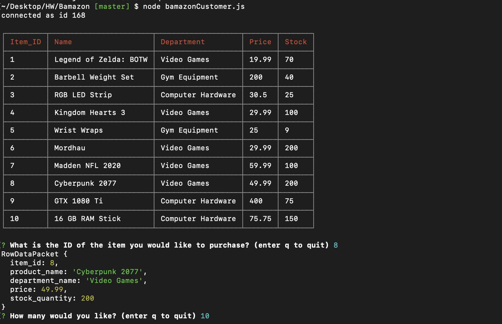

# Bamazon

* This app is a CLI mock storefront where we have items in stock and displayed to the user. In order to run this app you will need to install node. In the terminal/cmd prompt run "node bamazonCustomer.js" to start the app. Once the app begins the user will be prompted with the question: "What is the id of the item you would like to purchase?" The user then inputs an id corresponding to the desired item (displayed in CLI as a table) and is prompted "How many do you want?" The user then follows up with the quantity of the item they want. If the item has sufficient stock, then the stock is updated and the purchase is successful. If the item id does not exist or the stock is insufficient then the user is prompted accordingly.  Afterwards the app reruns the prompt inquiring once again what item would they like. The user can input "q" to quit the program at anytime.

## Technologies used (Run "npm i" to install packages):
* Node.js 
* Inquirer.js
* mysql.js
* cli-table2.js

## Author: Gabriel Jacobs
